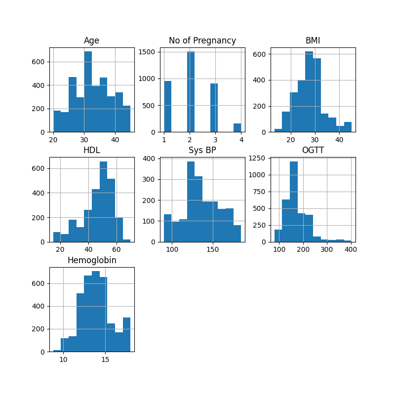
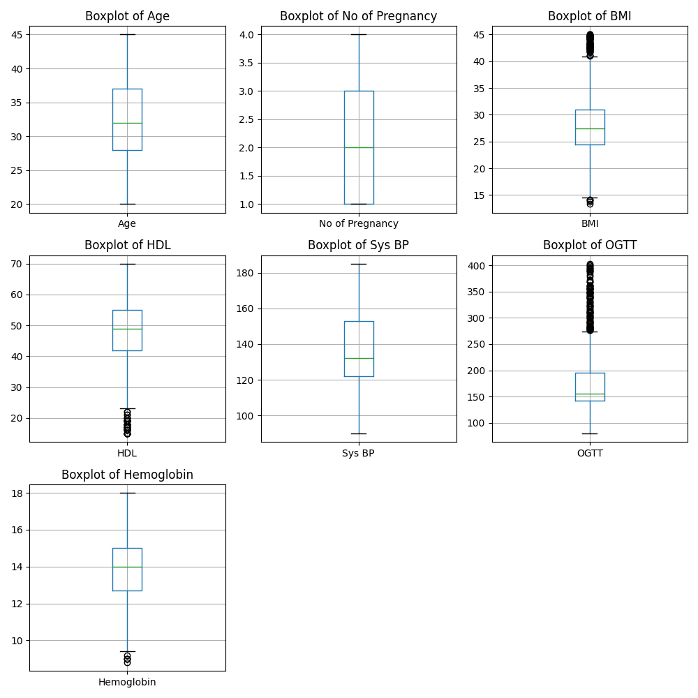
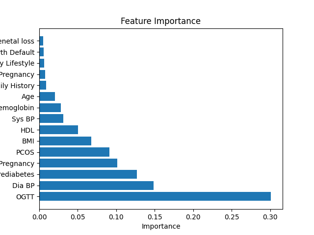
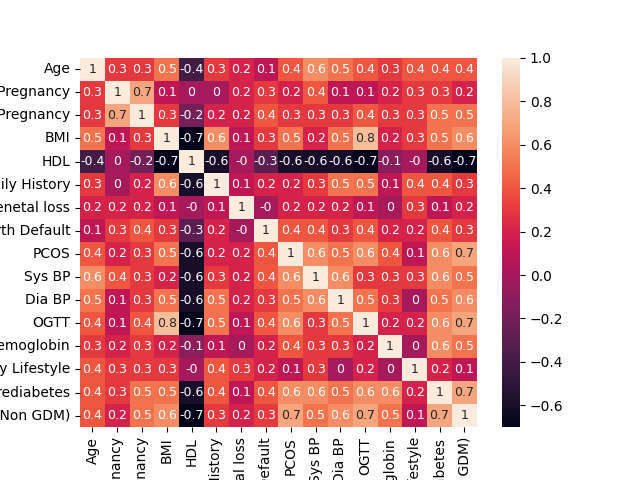

# Project Checkpoint 2

The descriptive analysis have been performed on the **data/Gestational Diabetic Dat Set.xlsx**.
The data set contains 3,525 entries with 18 features_
+ **Case Number**: Unique identifier for each patient in the study.
+ **Age**: The age of the patient at the time of the study.
+ **No of Pregnancy**: Total number of times the patient has been pregnant.
+ **Gestation in previous Pregnancy**: Duration of previous pregnancies in weeks.
+ **BMI**: Body Mass Index, a measure of body fat based on height and weight.
+ **HDL**: High-Density Lipoprotein cholesterol levels, often referred to as "good" cholesterol.
+ **Family History**: Presence of gestational diabetes in the patient's family history.
+ **Unexplained prenatal loss**: History of miscarriages or infant losses without known medical explanation.
+ **Large Child or Birth Defect**: History of giving birth to a large child or a child with birth defects.
+ **PCOS**: Indicates whether the patient has Polycystic Ovary Syndrome.
+ **Sys BP**: Systolic Blood Pressure, the pressure in the arteries when the heart beats.
+ **Dia BP**: Diastolic Blood Pressure, the pressure in the arteries when the heart rests between beats.
+ **OGTT**: Oral Glucose Tolerance Test results, a test for gestational diabetes.
+ **Hemoglobin**: Concentration of hemoglobin in the blood, which can indicate various health issues.
+ **Sedentary Lifestyle**: Indicates a lifestyle with minimal physical activity.
+ **Prediabetes**: Indicates whether the patient has blood glucose levels that are higher than normal but not yet high enough to be classified as diabetes.
+ **Class Label (GDM/Non GDM)**: The classification of whether the patient has gestational diabetes mellitus (GDM) or not.

The variable we aim to predict is **Class Label (GDM/Non GDM)**, which comprises 1,372 positive cases and 2,153 negative cases.

## 1. Distributions

The distributions of the numeric varaibles are as follows:

All of them seem normally distributed, except OGTT that seems log-normal.

## 2. Analysis of missing data and outliers

There are the folowing missiong data:
+ BMI: 1081
+ HDL: 1001
+ Sys BP: 1705
+ OGTT: 513

The boxplot does not indicate the presence of relevant outliers:

## 3. Plans for cleaning, including imputation, scaling, encoding, and other feature transformations

The OGTT values will undergo a logarithmic transformation to achieve normalization. Subsequently, numerical data will be standardized using a Standard Scaler. Encoding of categorical data is not necessary, as the dataset does not include multicategorical variables.

Imputation of missing values will be conducted using an Iterative Imputer with a Random Forest Regressor.

## 4. Any data enrichment you have done or plan to do (e.g., bringing in new datasets)

We have acquired a second dataset containing more detailed information and a significantly greater number of features. However, it is highly imbalanced, with only around 20 positive cases, and we are currently evaluating how to best utilize it.

## 5. Initial analysis of feature importance (if classification)
We have run a quick random forest to evaluate feature importance:

According to this analysis, features with less importance than **Age** may be considered for removal. Furthermore, the significance of OGTT underscores the necessity for accurate imputation of its missing values.

## 6. Observations about corrlelations in the data or other notable statistical features

The correlation amongst features are as follows:

There is a singnificant negative correlation between HDL and the other features.